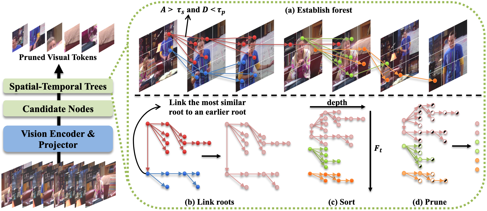

<div align="center">

# ForestPrune (**CVPR 2026** Finding)

### ForestPrune: High-ratio Visual Token Compression for Video Multimodal Large Language Models via Spatial-Temporal Forest Modeling

[]([[ArXiv Link](http://arxiv.org/abs/2603.22911)])
[]([[Project Page Link](https://github.com/luminousllsa/ForestPrune)])
<!-- []([Demo Link]) -->
<!-- []([License Link]) -->

**Official implementation of ForestPrune**

</div>

---

## 🔥 News

- **[2026/03/20]** Repository created.
- **[2026/03/25]** Paper released on arXiv.
- **[2026/03/25]** Code released.

---

## 📝 Introduction

### 1. Clone the repository
```
git clone https://github.com/luminousllsa/ForestPrune.git
cd ForestPrune
```

### 2. Create environment
```
conda create -n forestprune python=3.10 -y
conda activate forestprune
pip install -r requirements.txt
```

### 3. Quick Start
```
bash ./scripts/eval_mlvu.sh
```
---

## 📖 Abstract

Due to the great saving of computation and memory overhead, token compression has become a research hot-spot for MLLMs and achieved remarkable progress in imagelanguage tasks. However, for the video, existing methods still fall short of high-ratio token compression. We attribute this shortcoming to the insufficient modeling of temporal and continual video content, and propose a novel and training-free token pruning method for video MLLMs, termed ForestPrune, which achieves effective and highratio pruning via Spatial-temporal Forest Modeling. In practice, ForestPrune construct token forests across video frames based on the semantic, spatial and temporal constraints, making an overall comprehension of videos. Afterwards, ForestPrune evaluates the importance of token trees and nodes based on tree depth and node roles, thereby obtaining a globally optimal pruning decision. To validate ForestPrune, we apply it to two representative video MLLMs, namely LLaVA-Video and LLaVA-OneVision, and conduct extensive experiments on a bunch of video benchmarks. The experimental results not only show the great effectiveness for video MLLMs, e.g., retaining 95.8% average accuracy while reducing 90% tokens for LLaVAOneVision, but also show its superior performance and efficiency than the compared token compression methods, e.g., +10.1% accuracy on MLVU and -81.4% pruning time than FrameFusion on LLaVA-Video.

---

## 🖼️ Framework Overview

<div align="center">
  
</div>

<!-- **Figure:** [A short caption describing the framework.] -->

---

<!-- ## 🚀 Method

### Overview
[Describe your method briefly.]

### Key Ideas
- **[Idea 1]:** [description]
- **[Idea 2]:** [description]
- **[Idea 3]:** [description]

### Pipeline
1. [Step 1]
2. [Step 2]
3. [Step 3]
4. [Step 4]

---

## 📂 Repository Structure

```text
[repo_name]/
├── assets/                  # figures, teaser, demo gifs
├── configs/                 # config files
├── scripts/                 # train / eval / inference scripts
├── src/                     # source code
├── datasets/                # dataset preprocessing
├── checkpoints/             # saved checkpoints (optional)
├── outputs/                 # logs / results
├── requirements.txt
└── README.md -->